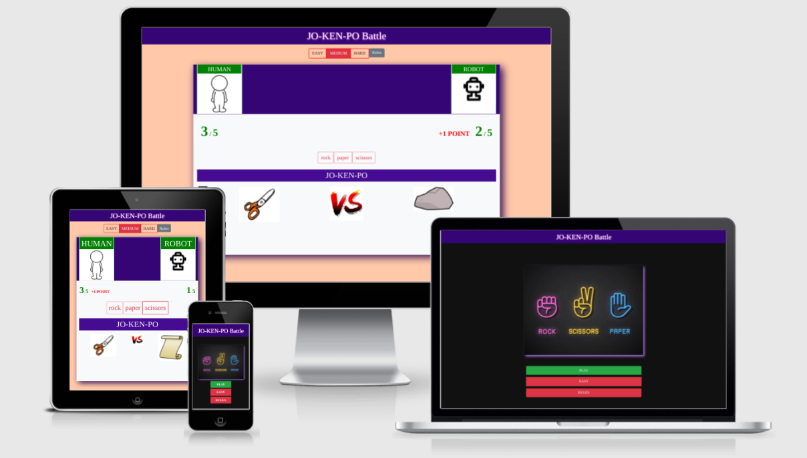

# MS2_Jo_Ken_Po_Game

[View the live project here.](https://rodrigopalazon.github.io/MS2_Jo_Ken_Po_Game/menu.html)

This is a Battle Game, that the player fights against the computer chosing between three "Powers". It is designed to be responsive and interactive.

<h2 align="center"></h2>

## User Experience (UX)

- ### User stories

   - #### First Time Visitor Goals

      1. As a First Time Visitor, I want to easily understand the main purpose of the site and learn more its content.
      2. As a First Time Visitor, I want to easily navigate throughout the site to find content.
      3. As a First Time Visitor, I want to easily recognize the clickable buttons and their functionalities.
      4. As a First Time Visitor, I want to easily understand how the game works or by being an obvious game or by receiving some instructions at the beginning.
   
   -   #### Returning Visitor Goals

        1. As a Returning Visitor, I want to find everything working as expected.
        2. As a Returning Visitor, I want to find a more modern and improved design.
        
   -   #### Frequent User Goals
        1. As a Frequent User, I want to check if there are any newly added features in the game.
        2. As a Frequent User, I want to check if there are any new way to make points and interact with the game.
        
   -   ### Design
    -   #### Colour Scheme
        -   The two main colors used are Code Institute dark blue, and white.
    -   #### Typography
        -   The Times New Roman font is the main font used throughout the whole website with Serif as the fallback font in the case for any reason the font isn't being imported into the site correctly. 
    -   #### Imagery
        -   Imagery is important. The character images help the user identifying which one he's playing with.
The powers' images reinforce the user's choice making the result easily understandable.

*   ### Wireframes

    -   Home Page Wireframe - [View](https://www.figma.com/file/hgVfsd9I89RFnBdP1VfAsN/MS2---Jo-Ken-Po?node-id=0%3A1)

## Features

-   Responsive on all device sizes

-   Interactive elements

## Technologies Used

### Languages Used

-   [HTML5](https://en.wikipedia.org/wiki/HTML5)
-   [CSS3](https://en.wikipedia.org/wiki/Cascading_Style_Sheets)
-   [JavaScript](https://en.wikipedia.org/wiki/JavaScript)

### Frameworks, Libraries & Programs Used

1. [Bootstrap 4.4.1:](https://getbootstrap.com/docs/4.4/getting-started/introduction/)
    - Bootstrap was used to assist with the responsiveness and styling of the website.
1. [jQuery:](https://jquery.com/)
    - jQuery came with Bootstrap to make the navbar responsive but was also used for the smooth scroll function in JavaScript.
1. [Git](https://git-scm.com/)
    - Git was used for version control by utilizing the Gitpod terminal to commit to Git and Push to GitHub.
1. [GitHub:](https://github.com/)
    - GitHub is used to store the project's code after being pushed from Git.
1. [Gimp:](https://www.gimp.org/)
    - Gimp was used to create the logo, resizing images, and editing photos for the website.
1. [Figma:](https://balsamiq.com/)
    - Figma was used to create the [wireframe](https://www.figma.com/file/hgVfsd9I89RFnBdP1VfAsN/MS2---Jo-Ken-Po?node-id=0%3A1) during the design process.

## Testing

The W3C Markup Validator and W3C CSS Validator Services were used to validate every page of the project to ensure there were no syntax errors in the project.

-   [W3C Markup Validator - menu.html](assets/images/readme/htmlValidator_menu.png) 
-   [W3C Markup Validator - index.html](assets/images/readme/htmlValidator_index.png) 
-   [W3C Markup Validator - index.html](assets/images/readme/htmlValidator_rules.png) 

-   [W3C CSS Validator - menu.css](assets/images/readme/cssValidator_menu.png) 
-   [W3C CSS Validator - style.css](assets/images/readme/cssValidator_style_index.png)
-   [W3C CSS Validator - rules.css](assets/images/readme/cssValidator_rules.png)


-   [JSHINT JS Validator - menu.js, and index.js] - Used JSHint plugin in Visual Studio Code IDE.
### Testing User Stories from User Experience (UX) Section

-   #### First Time Visitor Goals

    1. As a First Time Visitor, I want to easily understand the main purpose of the site and learn more about its content.

        1. Upon entering the site, users are automatically greeted with a clean and easily readable navigation bar to go to the page of their choice.
        2. The user has three options, click the "PLAY" button to start the game, click on the "EASY" button switch button's value through "EASY", "MEDIUM", "HARD", or clicking on "Rules" to learn more about the JO_KEN_PO Battle.

    2. As a First Time Visitor, I want to easily navigate throughout the site to find content.
        1. The site(game) has been designed to be fluid and never to entrap the user. At the top of each page, there is a bar with a clickable logo that always brings the user to the entrance page.
        2. At the game's main page, beneath the top bar, there are 3 buttons that the user can switch the level, making the number of rounds increasing or decreasing.
        3. Besides the levels' buttons, there is a "Rules" button, that displays an explanation of how the game works.

    3. As a First Time Visitor, I want to easily recognize the clickable buttons and their functionalities.
        1. The site(game) has been designed to be fluid and with clickable elements and their functionalities easily understandable.
    
    4. As a First Time Visitor, I want to easily understand how the game works or by being an obvious game or by receiving some instructions at the beginning.
        1. The site(game) has been designed that the user can independently in which page, section, or moment of the game, access the "Rules" page with just one click.
        2. The site(game) has been designed that the user can independently in which page, section, or moment of the game, access the JO_KEN_PO Battle page with just one click.

-   #### Returning Visitor Goals

    1. As a Returning Visitor, I want to find everything working as expected.
        1. I would not like to find any error or fail if no relevant improvement was made.
        2. Even with a more modern design, I want to be able to play the game without any difficulty.
    
    2. As a Returning Visitor, I want to find a more modern and improved design.
        1. Returning to the site(game), after few months, I want to recognize at least a few improvements, for example, a more modern button design, image, and/or fonts.

-   #### Frequent User Goals
    1. As a Frequent User, I want to check if there are any newly added features in the game.
        1. It can be a different rule, or a different character that I can play with, or a different "power" that I can use against the computer.
        2. It can be a different level of difficulty, or the option the choose some scenarios as a background.

    2. As a Frequent User, I want to check if there are any new ways to make points and interact with the game.
        1. It can be by accumulating points, or to have an opportunity to use a special power.

### Further Testing

-   The Website was tested on Google Chrome, Microsoft Edge, and Safari browsers.
-   The website was viewed on a variety of devices such as Desktop, Large Screens, Laptop, iPhone7, iPhone 8 & iPhone X.
-   A large amount of testing was done to ensure that all pages were linking correctly.
-   Friends and family members were asked to review the site and documentation to point out any bugs and/or user experience issues.
### Known Bugs

- For some devices, mainly mobiles, the images of rock, paper, and scissors can appear a bit disproportionate comparing to the rest of the page.

## Deployment

### GitHub Pages

The project was deployed to GitHub Pages using the following steps...

1. Log in to GitHub and locate the [GitHub Repository](https://github.com/RodrigoPalazon/MS2_Jo_Ken_Po_Game)
2. At the top of the Repository (not the top of the page), locate the "Settings" button on the menu.
    - Alternatively, click [Here](https://raw.githubusercontent.com/) for a GIF demonstrating the process starting from Step 2.
3. Scroll down the Settings page until you locate the "GitHub Pages" Section.
4. Under "Source", click the dropdown called "None" and select "Main Branch".
5. The page will automatically refresh.
6. Scroll back down through the page to locate the now published site [link](https://rodrigopalazon.github.io/MS2_Jo_Ken_Po_Game/) in the "GitHub Pages" section.

### Forking the GitHub Repository

By forking the GitHub Repository we make a copy of the original repository on our GitHub account to view and/or make changes without affecting the original repository by using the following steps...

1. Log in to GitHub and locate the [GitHub Repository](https://github.com/RodrigoPalazon/MS2_Jo_Ken_Po_Game)
2. At the top of the Repository (not top of page) just above the "Settings" button on the menu, locate the "Fork" button.
3. You should now have a copy of the original repository in your GitHub account.

### Making a Local Clone

1. Log in to GitHub and locate the [GitHub Repository](https://github.com/RodrigoPalazon/MS2_Jo_Ken_Po_Game)
2. Under the repository name, click "Clone or download".
3. To clone the repository using HTTPS, under "Clone with HTTPS", copy the link.
4. Open Git Bash
5. Change the current working directory to the location where you want the cloned directory to be made.
6. Type `git clone`, and then paste the URL you copied in Step 3.

```
$ git clone https://github.com/RodrigoPalazon/MS2_Jo_Ken_Po_Game
```

7. Press Enter. Your local clone will be created.

```
git clone https://github.com/RodrigoPalazon/MS2_Jo_Ken_Po_Game
Cloning into 'MS2_Jo_Ken_Po_Game'...
remote: Enumerating objects: 338, done.
remote: Counting objects: 100% (338/338), done.
remote: Compressing objects: 100% (234/234), done.
remote: Total 338 (delta 115), reused 293 (delta 73), pack-reused 0
Receiving objects: 100% (338/338), 5.38 MiB | 8.18 MiB/s, done.
Resolving deltas: 100% (115/115), done.

Click [Here](https://help.github.com/en/github/creating-cloning-and-archiving-repositories/cloning-a-repository#cloning-a-repository-to-github-desktop) to retrieve pictures for some of the buttons and more detailed explanations of the above process.

## CREDITS: 
---
#### Code and References:
    
    1. README: 
      - [Code-Institute-Solutions/SampleREADME](https://github.com/Code-Institute-Solutions/SampleREADME)
      - [Code-Institute-Solutions/readme-template](https://github.com/Code-Institute-Solutions/readme-template)

      All this README.md file used the above references to be created before, during, and after coding.

    2. CENTRALIZING DIV RESPONSIVILY:
      -[StackOverflow](https://stackoverflow.com/questions/12645366/css-responsive-center-div)
      Author:-[Steve Glick](https://stackoverflow.com/users/1618141/steve-glick)

    3. ACCESSIBILITY CONCEPTS:
      -[AccesComputing](https://www.washington.edu/accesscomputing/30-web-accessibility-tips)

    4. GETTING VALUE FROM THE SESSION STORAGE
      -[StackOverflow](https://stackoverflow.com/questions/63300478/how-to-get-value-from-session-storage)
      Author:-[Mike S.](https://stackoverflow.com/users/13258211/mike-s)

    5. HTML VALIDATOR'S SOLUTION:
      Button nested to a linke html's element.
      -[StackOverflow](https://stackoverflow.com/questions/6393827/can-i-nest-a-button-element-inside-an-a-using-html5)
      Author:-[LaserCat](https://stackoverflow.com/users/3135293/lasercat)

    6. JAVASCRIPT DOCSTRING:
       -[VisualStudio](https://marketplace.visualstudio.com/items?itemName=Massi.javascript-docstrings)
       -[WordPress](https://make.wordpress.org/core/handbook/best-practices/inline-documentation-standards/javascript/)

### Content

-   All content was written by [Rodrigo Palazon](https://github.com/RodrigoPalazon).

### Media

-   Rock, Paper, Scissors - [link](https://www.vecteezy.com/vector-art/691497-rock-paper-scissors-neon-icons).

-   Robot Image - [link](https://flyclipart.com/robot-icon-png-and-vector-for-free-download-robot-icon-png-245964).

-   Human Image - [link](https://png.is/f/free-person-icon-png-transparent-91500-download-person-icon-png/comdlpng6945136-201911171129.html).

### Acknowledgements

-   My Mentor [Jack Wachira](https://github.com/iamjackwachira) for continuous helpful feedback.

_-   Code Institute's tutors and students for their support via Slack._

